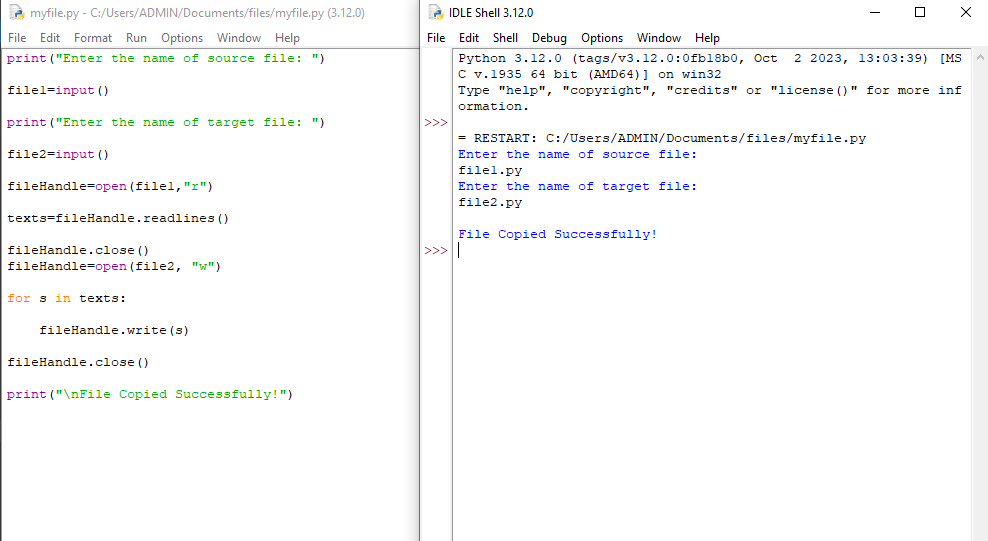
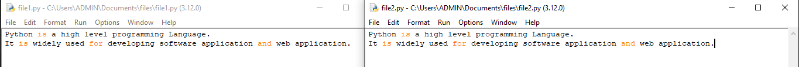

# copy-file
## AIM:
To write a python program for copying the contents from one file to another file.
## EQUIPEMENT'S REQUIRED: 
PC
Anaconda - Python 3.7
## ALGORITHM: 
### Step 1:
Get the file name to create user.

### Step 2: 
Give a new file name to create a copy of a file content.

### Step 3: 
Read the file and close the file.

### Step 4: 
Now the content in the new file.

### Step 5: 
When done print"File Copied Successfully".

### Step 6: 
End the program


## PROGRAM:
```
DEVELOPED BY:ISWARYA.P
REGISTER NO:23013459

print("Enter the name of source file: ")

file1=input()

print("Enter the name of target file: ")

file2=input()

fileHandle=open(file1,"r")

texts=fileHandle.readlines()

fileHandle.close()
fileHandle=open(file2, "w")

for s in texts:

    fileHandle.write(s)

fileHandle.close()

print("\nFile Copied Successfully!")
```


### OUTPUT:





## RESULT:
Thus the program is written to copy the contents from one file to another file.